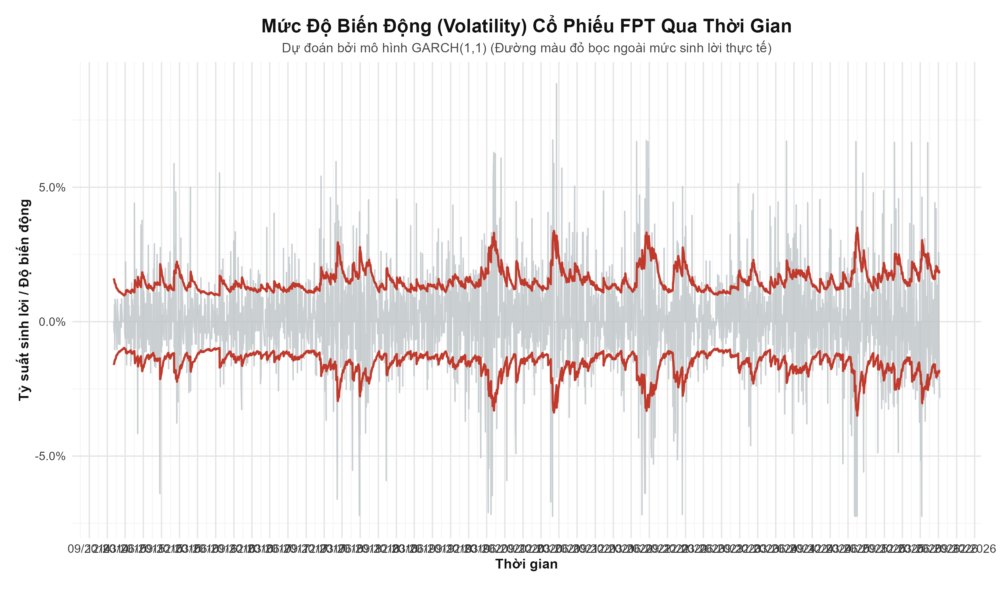

# FPT Stock Time Series Project

## 1. Thông tin chung

**Đề tài:** Dự báo giá và phân tích biến động cổ phiếu FPT bằng mô hình chuỗi thời gian.

**Môn học:** Lập Trình R Cho Phân Tích.

**Mục tiêu của project:**

- Thu thập dữ liệu lịch sử giá cổ phiếu FPT.
- Làm sạch và mô tả dữ liệu.
- Trực quan hóa biến động giá và lợi suất.
- Kiểm tra tính dừng của chuỗi thời gian.
- Xây dựng mô hình dự báo giá bằng ARIMA và ETS.
- Phân tích biến động/rủi ro bằng mô hình GARCH.
- So sánh mô hình, viết kết quả, thảo luận và kết luận.
- Xuất báo cáo cuối dạng Word.

Project này được chia thành 3 phần tương ứng với 3 thành viên. Mỗi người làm đúng phần được phân công, xuất đúng file đầu ra, sau đó Người 3 sẽ tổng hợp báo cáo cuối.

---

## 2. Nguyên tắc làm việc chung

Trước khi code, cả nhóm cần thống nhất các nguyên tắc sau:

1. **Không dùng đường dẫn tuyệt đối.**  
   Không viết kiểu:

   ```r
   read_csv("C:/Users/ABC/Desktop/FPT_stock_data.csv")
   ```

   Phải dùng đường dẫn tương đối từ thư mục gốc project:

   ```r
   read_csv("data/processed/fpt_clean.csv")
   ```

2. **Mọi file `.R` phải bắt đầu bằng:**

   ```r
   source("R/00_config.R")
   ```

   File `00_config.R` chứa cấu hình đường dẫn và thư viện dùng chung.

3. **Không sửa trực tiếp phần của người khác nếu chưa thống nhất.**  
   Nếu cần chỉnh file của người khác, phải báo trước trong nhóm.

4. **Mỗi người chỉ cần tạo đúng output của mình.**  
   Người sau sẽ đọc output đó để tiếp tục làm. Ví dụ:
   - Người 1 tạo `data/processed/fpt_clean.csv`.
   - Người 2 đọc `fpt_clean.csv`, sau đó tạo `forecast_metrics.csv`.
   - Người 3 đọc `forecast_metrics.csv` và kết quả GARCH để viết báo cáo.

5. **Không commit file rác.**  
   Không đưa vào Git các file như `.Rhistory`, `.RData`, file tạm, file lỗi, ảnh thừa hoặc bản báo cáo nháp quá nhiều phiên bản.

6. **Tên file không dùng dấu tiếng Việt và không dùng khoảng trắng.**  
   Nên dùng:

   ```text
   fpt_clean.csv
   close_price.png
   garch_volatility.png
   forecast_metrics.csv
   ```

   Không nên dùng:

   ```text
   dữ liệu sạch.csv
   biểu đồ giá đóng cửa.png
   ```

---

## 3. Cấu trúc thư mục của repo

Repo cần có cấu trúc như sau:

```text
fpt-stock-time-series/
│
├── README.md
├── .gitignore
├── FPT_Stock_TimeSeries.Rproj
│
├── data/
│   ├── raw/
│   │   └── FPT_stock_data.csv
│   ├── processed/
│   │   └── fpt_clean.csv
│   └── README_data.md
│
├── notebooks/
│   └── 01_scrape_fpt_colab.ipynb
│
├── R/
│   ├── 00_config.R
│   ├── 01_data_cleaning.R
│   ├── 02_visualization.R
│   ├── 03_stationarity_arima_ets.R
│   ├── 04_garch_volatility.R
│   ├── 05_model_comparison.R
│   └── 06_export_report_tables.R
│
├── output/
│   ├── figures/
│   │   ├── close_price.png
│   │   ├── returns.png
│   │   ├── arima_forecast.png
│   │   ├── ets_forecast.png
│   │   └── garch_volatility.png
│   ├── tables/
│   │   ├── data_summary.csv
│   │   ├── stationarity_tests.csv
│   │   ├── forecast_metrics.csv
│   │   ├── garch_summary.csv
│   │   └── model_comparison.csv
│   └── models/
│       ├── arima_model.rds
│       ├── ets_model.rds
│       └── garch_model.rds
│
├── report/
│   ├── report.Rmd
│   ├── report.docx
│   └── sections/
│       ├── 01_introduction.md
│       ├── 02_data.md
│       ├── 03_visualization.md
│       ├── 04_modeling_arima_ets.md
│       ├── 05_garch_results_discussion.md
│       └── 06_conclusion.md
│
└── docs/
    ├── rubric/
    └── references/
```

Ý nghĩa các thư mục:

| Thư mục | Ý nghĩa |
|---|---|
| `data/raw/` | Dữ liệu gốc vừa cào về, chưa xử lý. |
| `data/processed/` | Dữ liệu đã làm sạch, dùng cho phân tích R. |
| `notebooks/` | Notebook Python/Colab để thu thập dữ liệu. |
| `R/` | Toàn bộ mã nguồn R. |
| `output/figures/` | Biểu đồ xuất ra từ R. |
| `output/tables/` | Bảng kết quả, bảng thống kê, bảng metrics. |
| `output/models/` | Model đã lưu bằng `.rds`. |
| `report/` | Báo cáo cuối. |
| `report/sections/` | Các phần báo cáo do từng người viết riêng. |
| `docs/` | Rubric, tài liệu tham khảo, đề bài. |

---

## 4. Cài đặt môi trường R

Mở RStudio tại thư mục gốc project, sau đó chạy một lần:

```r
install.packages(c(
  "tidyverse",
  "lubridate",
  "forecast",
  "tseries",
  "rugarch",
  "knitr",
  "rmarkdown"
))
```

Ý nghĩa các package:

| Package | Dùng để làm gì? |
|---|---|
| `tidyverse` | Đọc, xử lý, làm sạch dữ liệu, vẽ ggplot. |
| `lubridate` | Xử lý ngày tháng. |
| `forecast` | Xây dựng ARIMA, ETS và dự báo. |
| `tseries` | Kiểm định ADF. |
| `rugarch` | Xây dựng mô hình GARCH. |
| `knitr`, `rmarkdown` | Knit báo cáo `.Rmd` sang Word. |

---

## 5. File cấu hình chung `R/00_config.R`

File này bắt buộc phải có. Nội dung đề xuất:

```r
# 00_config.R
# Cấu hình chung cho toàn bộ project

library(tidyverse)
library(lubridate)

RAW_DATA_PATH <- "data/raw/FPT_stock_data.csv"
CLEAN_DATA_PATH <- "data/processed/fpt_clean.csv"

FIGURE_DIR <- "output/figures"
TABLE_DIR <- "output/tables"
MODEL_DIR <- "output/models"

REPORT_DIR <- "report"
SECTION_DIR <- "report/sections"

dir.create("data/raw", recursive = TRUE, showWarnings = FALSE)
dir.create("data/processed", recursive = TRUE, showWarnings = FALSE)
dir.create(FIGURE_DIR, recursive = TRUE, showWarnings = FALSE)
dir.create(TABLE_DIR, recursive = TRUE, showWarnings = FALSE)
dir.create(MODEL_DIR, recursive = TRUE, showWarnings = FALSE)
dir.create(REPORT_DIR, recursive = TRUE, showWarnings = FALSE)
dir.create(SECTION_DIR, recursive = TRUE, showWarnings = FALSE)
```

Sau đó, đầu mỗi file R phải có:

```r
source("R/00_config.R")
```

---

## 6. Chuẩn dữ liệu chung cho cả nhóm

Người 1 phải tạo file dữ liệu sạch tại:

```text
data/processed/fpt_clean.csv
```

File này là đầu vào bắt buộc cho Người 2 và Người 3.

### 6.1. Các cột bắt buộc

`fpt_clean.csv` cần có tối thiểu các cột sau:

| Cột | Kiểu dữ liệu | Ý nghĩa |
|---|---|---|
| `date` | Date hoặc chuỗi dạng `YYYY-MM-DD` | Ngày giao dịch. |
| `open` | numeric | Giá mở cửa. |
| `high` | numeric | Giá cao nhất trong ngày. |
| `low` | numeric | Giá thấp nhất trong ngày. |
| `close` | numeric | Giá đóng cửa. |
| `volume` | numeric | Khối lượng giao dịch. |
| `log_close` | numeric | Log tự nhiên của giá đóng cửa. |
| `return` | numeric | Log return, tính bằng `log_close - lag(log_close)`. |

### 6.2. Công thức cần thống nhất

```r
log_close = log(close)
return = log_close - lag(log_close)
```

### 6.3. Yêu cầu kiểm tra dữ liệu sạch

Trước khi Người 1 bàn giao dữ liệu, cần đảm bảo:

- Không trùng ngày giao dịch.
- Cột `date` đã được sắp xếp tăng dần.
- Cột `close` không bị thiếu dữ liệu.
- Các cột giá và `volume` là kiểu số.
- `return` chỉ được phép có `NA` ở dòng đầu tiên do dùng `lag()`.

Có thể kiểm tra bằng R:

```r
fpt <- read_csv("data/processed/fpt_clean.csv")

sum(is.na(fpt$close))
sum(duplicated(fpt$date))
str(fpt)
summary(fpt)
```

Nếu `sum(is.na(fpt$close))` lớn hơn 0 hoặc `sum(duplicated(fpt$date))` lớn hơn 0 thì dữ liệu chưa đạt yêu cầu.

---

## 7. Phân công chi tiết

## 7.1. Người 1 - Data + Visualization

### Nhiệm vụ chính

Người 1 phụ trách toàn bộ phần dữ liệu và trực quan hóa ban đầu.

Cần làm:

- Thu thập dữ liệu bằng notebook Python/Colab.
- Lưu dữ liệu gốc vào `data/raw/FPT_stock_data.csv`.
- Làm sạch dữ liệu trong R.
- Kiểm tra dữ liệu thiếu.
- Kiểm tra dữ liệu trùng.
- Tạo thống kê mô tả.
- Tạo các biểu đồ cơ bản.
- Viết mục `Data` và `Visualization` trong báo cáo.

### File phụ trách

```text
notebooks/01_scrape_fpt_colab.ipynb
R/01_data_cleaning.R
R/02_visualization.R
report/sections/02_data.md
report/sections/03_visualization.md
```

### Output bắt buộc

```text
data/processed/fpt_clean.csv
output/tables/data_summary.csv
output/figures/close_price.png
output/figures/returns.png
```

### Checklist trước khi báo xong

Người 1 chỉ báo hoàn thành khi đã có đủ:

- [ ] `data/raw/FPT_stock_data.csv`
- [ ] `data/processed/fpt_clean.csv`
- [ ] `output/tables/data_summary.csv`
- [ ] `output/figures/close_price.png`
- [ ] `output/figures/returns.png`
- [ ] Viết xong `report/sections/02_data.md`
- [ ] Viết xong `report/sections/03_visualization.md`

---

## 7.2. Người 2 - Modeling ARIMA/ETS

### Nhiệm vụ chính

Người 2 phụ trách kiểm tra tính dừng và xây dựng mô hình dự báo giá.

Cần làm:

- Đọc dữ liệu sạch từ `data/processed/fpt_clean.csv`.
- Kiểm định ADF cho chuỗi giá gốc hoặc chuỗi log giá.
- Thực hiện log transform nếu cần.
- Thực hiện differencing nếu chuỗi chưa dừng.
- Xây dựng mô hình ARIMA.
- Xây dựng mô hình ETS.
- Dự báo trên tập test.
- Tính RMSE và MAPE cho ARIMA và ETS.
- Vẽ biểu đồ dự báo.
- Viết mục `Modeling (ARIMA, ETS)`.

### File phụ trách

```text
R/03_stationarity_arima_ets.R
report/sections/04_modeling_arima_ets.md
```

### Output bắt buộc

```text
output/tables/stationarity_tests.csv
output/tables/forecast_metrics.csv
output/figures/arima_forecast.png
output/figures/ets_forecast.png
output/models/arima_model.rds
output/models/ets_model.rds
```

### Chuẩn file `forecast_metrics.csv`

File này cần có dạng:

```text
model,rmse,mape
ARIMA,...,...
ETS,...,...
```

Ví dụ:

```text
model,rmse,mape
ARIMA,1532.25,2.14
ETS,1720.48,2.51
```

### Checklist trước khi báo xong

Người 2 chỉ báo hoàn thành khi đã có đủ:

- [ ] Đã đọc được `data/processed/fpt_clean.csv`
- [ ] `output/tables/stationarity_tests.csv`
- [ ] `output/tables/forecast_metrics.csv`
- [ ] `output/figures/arima_forecast.png`
- [ ] `output/figures/ets_forecast.png`
- [ ] `output/models/arima_model.rds`
- [ ] `output/models/ets_model.rds`
- [ ] Viết xong `report/sections/04_modeling_arima_ets.md`

---

## 7.3. Người 3 - GARCH + Results & Discussion + Tổng hợp báo cáo

### Nhiệm vụ chính

Người 3 phụ trách mô hình GARCH, phân tích volatility, so sánh mô hình, viết kết quả/thảo luận, viết kết luận và ghép báo cáo cuối.

Cần làm:

- Đọc dữ liệu sạch từ `data/processed/fpt_clean.csv`.
- Xây dựng mô hình GARCH(1,1) trên chuỗi `return`.
- Phân tích volatility của cổ phiếu FPT.
- Xuất bảng tham số GARCH.
- Xuất biểu đồ conditional volatility.
- Đọc `forecast_metrics.csv` của Người 2.
- So sánh ARIMA và ETS bằng RMSE/MAPE.
- Giải thích rõ vai trò của GARCH: GARCH dùng cho volatility, không so sánh trực tiếp với ARIMA/ETS bằng RMSE/MAPE nếu không dùng GARCH để dự báo giá.
- Viết mục `Results & Discussion`.
- Viết mục `Conclusion`.
- Ghép báo cáo cuối thành `report/report.docx`.

### File phụ trách

```text
R/04_garch_volatility.R
R/05_model_comparison.R
R/06_export_report_tables.R
report/sections/05_garch_results_discussion.md
report/sections/06_conclusion.md
report/report.Rmd
```

### Output bắt buộc

```text
output/tables/garch_summary.csv
output/tables/model_comparison.csv
output/figures/garch_volatility.png
output/models/garch_model.rds
report/report.docx
```

### Chuẩn file `garch_summary.csv`

File này nên có dạng:

```text
parameter,estimate
mu,...
omega,...
alpha1,...
beta1,...
```

### Chuẩn file `model_comparison.csv`

File này nên có dạng:

```text
model,rmse,mape,purpose
ARIMA,...,...,Dự báo giá đóng cửa
ETS,...,...,Dự báo giá đóng cửa
GARCH(1,1),NA,NA,Phân tích volatility
```

### Checklist trước khi báo xong

Người 3 chỉ báo hoàn thành khi đã có đủ:

- [ ] Đã đọc được `data/processed/fpt_clean.csv`
- [ ] Đã chạy được mô hình GARCH
- [ ] `output/tables/garch_summary.csv`
- [ ] `output/figures/garch_volatility.png`
- [ ] `output/models/garch_model.rds`
- [ ] Đã đọc được `output/tables/forecast_metrics.csv`
- [ ] `output/tables/model_comparison.csv`
- [ ] Viết xong `report/sections/05_garch_results_discussion.md`
- [ ] Viết xong `report/sections/06_conclusion.md`
- [ ] Knit được `report/report.docx`

---

## 8. Thứ tự chạy toàn bộ project

Chạy project theo đúng thứ tự sau:

### Bước 1: Thu thập dữ liệu bằng Python/Colab

Mở notebook:

```text
notebooks/01_scrape_fpt_colab.ipynb
```

Chạy notebook để lấy dữ liệu FPT, sau đó lưu file vào:

```text
data/raw/FPT_stock_data.csv
```

### Bước 2: Làm sạch dữ liệu

Chạy:

```r
source("R/01_data_cleaning.R")
```

Kết quả cần có:

```text
data/processed/fpt_clean.csv
output/tables/data_summary.csv
```

### Bước 3: Trực quan hóa dữ liệu

Chạy:

```r
source("R/02_visualization.R")
```

Kết quả cần có:

```text
output/figures/close_price.png
output/figures/returns.png
```

### Bước 4: Kiểm định tính dừng, ARIMA và ETS

Chạy:

```r
source("R/03_stationarity_arima_ets.R")
```

Kết quả cần có:

```text
output/tables/stationarity_tests.csv
output/tables/forecast_metrics.csv
output/figures/arima_forecast.png
output/figures/ets_forecast.png
output/models/arima_model.rds
output/models/ets_model.rds
```

### Bước 5: GARCH và volatility

Chạy:

```r
source("R/04_garch_volatility.R")
```

Kết quả cần có:

```text
output/tables/garch_summary.csv
output/figures/garch_volatility.png
output/models/garch_model.rds
```

### Bước 6: So sánh mô hình

Chạy:

```r
source("R/05_model_comparison.R")
```

Kết quả cần có:

```text
output/tables/model_comparison.csv
```

### Bước 7: Knit báo cáo Word

Mở:

```text
report/report.Rmd
```

Bấm **Knit** trong RStudio hoặc chạy:

```r
rmarkdown::render("report/report.Rmd", output_format = "word_document")
```

Kết quả cuối:

```text
report/report.docx
```

---

## 9. Quy ước viết code R

### 9.1. Cách đặt tên biến

Dùng `snake_case`:

```r
fpt_clean
forecast_metrics
garch_summary
train_data
test_data
```

Không nên dùng:

```r
FptClean
forecastMetrics
data1
aaa
```

### 9.2. Cách comment code

Mỗi phần lớn nên có comment rõ ràng:

```r
# 1. Đọc dữ liệu
# 2. Kiểm tra dữ liệu thiếu
# 3. Tính log return
# 4. Xuất dữ liệu sạch
```

### 9.3. Cách xuất bảng

Luôn xuất bảng bằng `write_csv()`:

```r
write_csv(data_summary, file.path(TABLE_DIR, "data_summary.csv"))
```

### 9.4. Cách lưu biểu đồ

Luôn lưu biểu đồ bằng `ggsave()`:

```r
ggsave(
  filename = file.path(FIGURE_DIR, "close_price.png"),
  plot = p_close,
  width = 10,
  height = 5
)
```

### 9.5. Cách lưu model

Luôn lưu model bằng `saveRDS()`:

```r
saveRDS(model_arima, file.path(MODEL_DIR, "arima_model.rds"))
```

Đọc lại model bằng:

```r
model_arima <- readRDS(file.path(MODEL_DIR, "arima_model.rds"))
```

---

## 10. Quy ước viết báo cáo

Báo cáo được chia thành nhiều file nhỏ trong:

```text
report/sections/
```

Mỗi người viết đúng section của mình.

### Người 1 viết

```text
report/sections/02_data.md
report/sections/03_visualization.md
```

Nội dung cần có:

- Dữ liệu lấy từ đâu.
- Dữ liệu có những cột nào.
- Dữ liệu có bao nhiêu dòng.
- Giai đoạn dữ liệu từ ngày nào đến ngày nào.
- Có thiếu dữ liệu không.
- Có trùng dữ liệu không.
- Nhận xét thống kê mô tả.
- Nhận xét biểu đồ giá đóng cửa.
- Nhận xét biểu đồ return.

### Người 2 viết

```text
report/sections/04_modeling_arima_ets.md
```

Nội dung cần có:

- Vì sao phải kiểm tra tính dừng.
- Kết quả kiểm định ADF.
- Vì sao dùng log transform.
- Vì sao dùng differencing.
- Mô hình ARIMA được chọn là gì.
- Mô hình ETS được chọn là gì.
- So sánh RMSE/MAPE của ARIMA và ETS.
- Nhận xét mô hình nào dự báo tốt hơn.

### Người 3 viết

```text
report/sections/05_garch_results_discussion.md
report/sections/06_conclusion.md
```

Nội dung cần có:

- Vì sao dùng GARCH.
- GARCH dùng chuỗi nào làm đầu vào.
- Ý nghĩa các tham số `omega`, `alpha1`, `beta1`.
- Nhận xét volatility của FPT.
- So sánh vai trò của ARIMA, ETS và GARCH.
- Thảo luận kết quả chung.
- Kết luận.
- Hạn chế của đề tài.
- Hướng phát triển.

---

## 11. Khung `report/report.Rmd`

File `report/report.Rmd` nên có dạng:

````markdown
---
title: "Dự báo giá và phân tích biến động cổ phiếu FPT bằng mô hình chuỗi thời gian"
author: "Nhóm ..."
date: "`r Sys.Date()`"
output:
  word_document:
    toc: true
    toc_depth: 3
---

```{r setup, include=FALSE}
knitr::opts_chunk$set(
  echo = FALSE,
  warning = FALSE,
  message = FALSE
)

library(tidyverse)
```

```{r child="sections/01_introduction.md"}
```

```{r child="sections/02_data.md"}
```

```{r child="sections/03_visualization.md"}
```

```{r child="sections/04_modeling_arima_ets.md"}
```

```{r child="sections/05_garch_results_discussion.md"}
```

```{r child="sections/06_conclusion.md"}
```
````

---

## 12. Git workflow cho cả nhóm

### 12.1. Lần đầu clone repo

```bash
git clone <link-repo>
cd fpt-stock-time-series
```

### 12.2. Mỗi người tạo branch riêng

Người 1:

```bash
git checkout -b person1-data-visualization
```

Người 2:

```bash
git checkout -b person2-arima-ets
```

Người 3:

```bash
git checkout -b person3-garch-report
```

### 12.3. Trước khi làm luôn kéo code mới nhất

```bash
git checkout main
git pull origin main
```

Sau đó chuyển sang branch của mình:

```bash
git checkout person3-garch-report
```

### 12.4. Commit sau mỗi phần đã chạy được

```bash
git status
git add .
git commit -m "Add GARCH volatility analysis"
git push origin person3-garch-report
```

### 12.5. Quy ước message commit

Nên viết rõ nội dung:

```text
Add data cleaning script
Add visualization figures
Add ARIMA and ETS modeling
Add GARCH volatility analysis
Update results discussion
Update final report
```

Không nên viết:

```text
fix
update
abc
lan 1
bai moi
```

---

## 13. Checklist trước khi nộp bài

Trước khi nộp, cả nhóm kiểm tra đủ các mục sau:

### Dữ liệu

- [ ] Có `data/raw/FPT_stock_data.csv`.
- [ ] Có `data/processed/fpt_clean.csv`.
- [ ] Dữ liệu sạch không bị thiếu `close`.
- [ ] Dữ liệu sạch không trùng `date`.
- [ ] Dữ liệu được sắp xếp tăng dần theo `date`.

### Bảng kết quả

- [ ] Có `output/tables/data_summary.csv`.
- [ ] Có `output/tables/stationarity_tests.csv`.
- [ ] Có `output/tables/forecast_metrics.csv`.
- [ ] Có `output/tables/garch_summary.csv`.
- [ ] Có `output/tables/model_comparison.csv`.

### Hình ảnh

- [ ] Có `output/figures/close_price.png`.
- [ ] Có `output/figures/returns.png`.
- [ ] Có `output/figures/arima_forecast.png`.
- [ ] Có `output/figures/ets_forecast.png`.
- [ ] Có `output/figures/garch_volatility.png`.

### Model

- [ ] Có `output/models/arima_model.rds`.
- [ ] Có `output/models/ets_model.rds`.
- [ ] Có `output/models/garch_model.rds`.

### Báo cáo

- [ ] Có đủ các section trong `report/sections/`.
- [ ] Có `report/report.Rmd`.
- [ ] Knit được `report/report.docx`.
- [ ] Báo cáo có bảng phân công nhiệm vụ.
- [ ] Báo cáo có mô tả dữ liệu.
- [ ] Báo cáo có biểu đồ và nhận xét.
- [ ] Báo cáo có ít nhất 3 mô hình: ARIMA, ETS, GARCH.
- [ ] Báo cáo có RMSE, MAPE cho ARIMA và ETS.
- [ ] Báo cáo có phần Results & Discussion.
- [ ] Báo cáo có kết luận và hướng phát triển.

---

## 14. Gắn với Rubric để đạt điểm cao

| Tiêu chí rubric | Cách project đáp ứng |
|---|---|
| Hình thức báo cáo | Có báo cáo Word, chia mục rõ ràng, có bảng, hình, kết luận. |
| Kỹ năng làm việc nhóm | README có phân công rõ từng người, file phụ trách và output cần tạo. |
| Mô tả dữ liệu và xác định bài toán | Có mục Data, mô tả nguồn dữ liệu, biến, giai đoạn, thống kê mô tả. |
| Sử dụng R cho phân tích | Toàn bộ xử lý, modeling, visualization, output thực hiện bằng R. |
| Sử dụng đồ thị | Có biểu đồ giá đóng cửa, return, forecast ARIMA/ETS, volatility GARCH. |
| Sử dụng mô hình dữ liệu | Có ít nhất 3 mô hình: ARIMA, ETS, GARCH. |

Để đạt điểm cao, mỗi biểu đồ trong báo cáo phải có **nhận xét**, không chỉ chèn hình. Mỗi mô hình phải có **giải thích ý nghĩa**, không chỉ đưa code.

---

## 15. Lỗi thường gặp và cách xử lý

### Lỗi 1: Không tìm thấy file dữ liệu

Thông báo thường gặp:

```text
cannot open file 'data/processed/fpt_clean.csv'
```

Cách xử lý:

- Kiểm tra đã chạy `R/01_data_cleaning.R` chưa.
- Kiểm tra file `fpt_clean.csv` có nằm đúng trong `data/processed/` không.
- Kiểm tra đang mở RStudio tại thư mục gốc project chưa.

### Lỗi 2: Cột `date` không phải ngày

Cách xử lý:

```r
fpt <- fpt %>%
  mutate(date = as.Date(date))
```

### Lỗi 3: Cột giá đang là character

Cách xử lý:

```r
fpt <- fpt %>%
  mutate(
    open = as.numeric(open),
    high = as.numeric(high),
    low = as.numeric(low),
    close = as.numeric(close),
    volume = as.numeric(volume)
  )
```

### Lỗi 4: Không cài được package `rugarch`

Thử cài lại:

```r
install.packages("rugarch", dependencies = TRUE)
```

Nếu vẫn lỗi, báo cho nhóm để Người 3 xử lý riêng phần GARCH.

### Lỗi 5: Knit báo cáo không thấy hình

Cần kiểm tra đường dẫn hình trong file `.md`. Khi file `.md` nằm trong `report/sections/`, đường dẫn hình có thể cần dùng:

```markdown

```

Nếu chèn hình trong `report.Rmd` từ thư mục `report/`, đường dẫn thường là:

```markdown

```

---

## 16. Quy ước bàn giao giữa các thành viên

Khi một người làm xong phần của mình, cần gửi tin nhắn trong nhóm theo mẫu:

```text
Mình đã xong phần Người 1.
Đã tạo các file:
- data/processed/fpt_clean.csv
- output/tables/data_summary.csv
- output/figures/close_price.png
- output/figures/returns.png
- report/sections/02_data.md
- report/sections/03_visualization.md

Mọi người pull code mới nhất trước khi làm tiếp.
```

Người 2 và Người 3 cũng báo tương tự để tránh thiếu file.

---

## 17. Tóm tắt cực ngắn cho từng người

### Người 1

Làm dữ liệu và hình ban đầu. Quan trọng nhất là phải tạo được:

```text
data/processed/fpt_clean.csv
```

Nếu thiếu file này, Người 2 và Người 3 không làm tiếp được.

### Người 2

Làm ARIMA và ETS. Quan trọng nhất là phải tạo được:

```text
output/tables/forecast_metrics.csv
```

Nếu thiếu file này, Người 3 không so sánh mô hình được.

### Người 3

Làm GARCH, Results & Discussion, kết luận và ghép báo cáo. Quan trọng nhất là phải tạo được:

```text
output/tables/model_comparison.csv
report/report.docx
```

---

## 18. Liên hệ và cập nhật

Nếu thay đổi cấu trúc thư mục, tên file output hoặc cách chia nhiệm vụ, phải cập nhật lại README này ngay để cả nhóm làm thống nhất.
